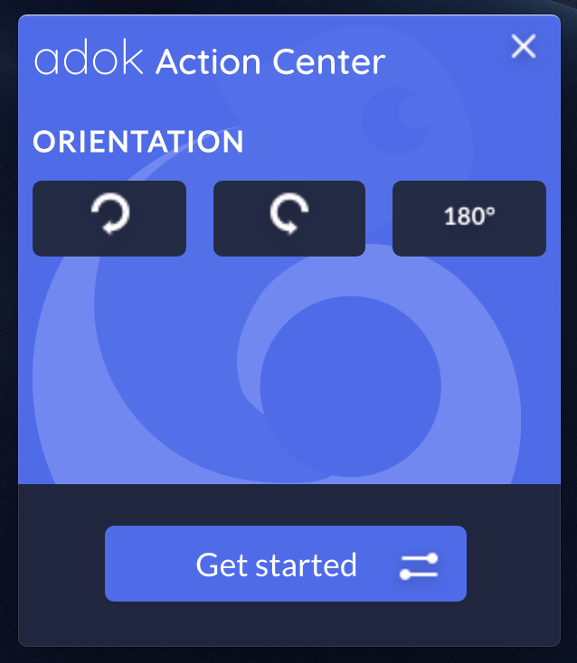

# APP-AdokActionCenter

|Application Type  |Technos/Languages|
|------------------|-----------------|
|`Windows application`  |`Electron` `JS` `HTML` `SCSS`|

#
 ### Goal

The Adok Action Center is a windows desktop app that allows you to control some settings, it's launched and hided at the windows start up.

The Action Center is used to change the screen orientation.
The Getting Started can be launched from this app

#
 
 ### Upcoming features
* Screen Resising
* Possibility to change the brightness

# 
 ### Screen

 #
 Created by **Marc-Andre Ploux** and **Mehdi Meziyane**

